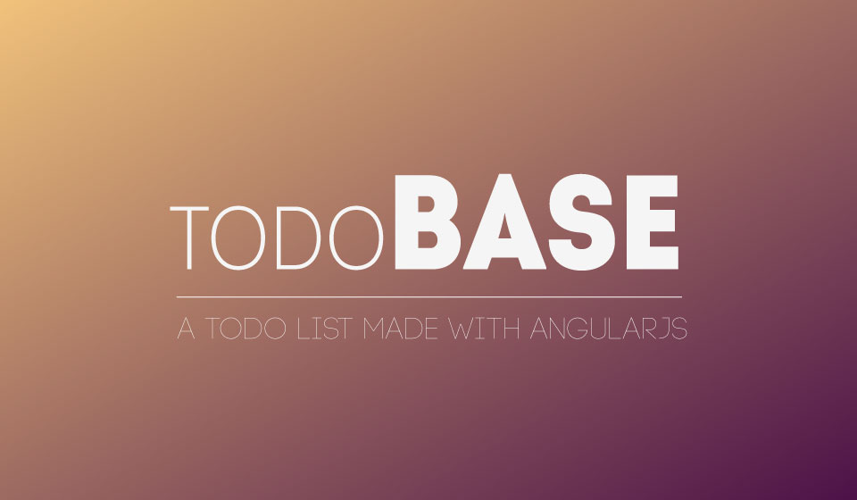

# todoBASE

Lista de tarefas


## Instalação

-   Clone o repositório;
-   ``` npm install ``` para instalar as dependências;
-   ``` gulp pullTheBoss ``` para iniciar o ambiente de desenvolvimento;

## Testes

-   `karma start`

Os testes não estão funcionando corretamente, tentei o Karma com mocha e chai e não obitive sucesso em sua configuração (principalmente em relação ao chai). Caso possam ajudar ficarei grato! ;)
